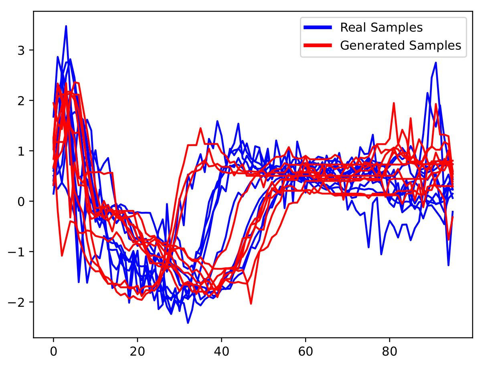
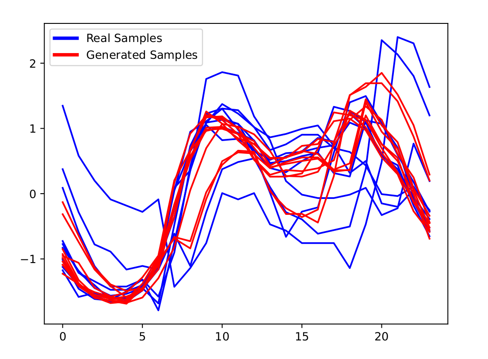
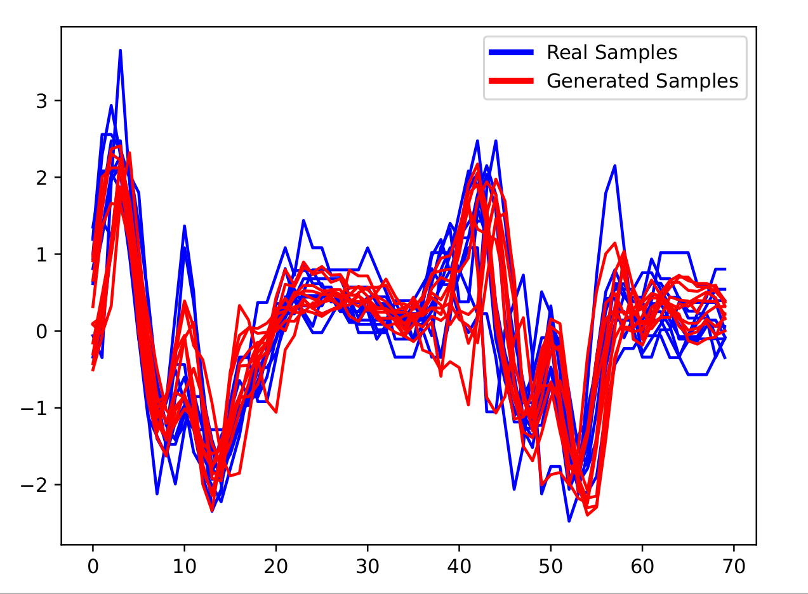

# Augmenting Time Series Data with Elastic Averaging Methods

author: [Ali Ismail-Fawaz](https://hadifawaz1999.github.io), [@hadifawaz1999](https://github.com/hadifawaz1999)

This repository contains a python code that supports the weighted Barycenter Average method for time series data proposed by [Forestier et al. 2017 [1] " Generating synthetic time series to augment sparse datasets" In IEEE International Conference on Data Mining (ICDM)](https://doi.org/10.1109/ICDM.2017.106). Their original proposal was to use Dynamic Time Warping Barycenter Average (DBA) [Petitjean et al. 2011](https://www.sciencedirect.com/science/article/abs/pii/S003132031000453X) [2] to generate synthetic data in order to enhance supervised learning for the task of Time Series Classification.

In this repository, we re-call the work of [Forestier et al. 2017](https://www.sciencedirect.com/science/article/abs/pii/S003132031000453X) [1], leveraging the new time series machine learning python package, [aeon](https://github.com/aeon-toolkit/aeon), in order to use the fastest available version of elastic barycenter averaging technique.
Instead of only being able to use DBA to augment new data, we also give the user availability to choose the similarity measure of their choice, either doing DBA with DTW, or shapeDBA [Ismail-Fawaz et al. 2023](https://link.springer.com/chapter/10.1007/978-3-031-49896-1_9) [3] with shapeDTW, MBA [Holder et al. 2023](https://pdfs.semanticscholar.org/bd4a/6998610ca107cbda8bc24bc003bfe32617b9.pdf) [4] with MSM etc.
We add the possibility to try out the augmentation technique with a simple K-Nearest-Neighbors classifier to showcase the augmentation's add-on information to the training dataset.

In what follows, we list the required information to be able to run the code.

## Requirements

This work requires a python version `>=3.10.12`

In order to use the version of aeon that made this work possible, please install version 0.11.1 of the aeon toolkit

The following packages are installed by default with aeon: `numpy`, `scikit-learn`, `pandas`.

The rest of the packages are to be manually installed:

```
hydra-core==1.3.2
matplotlib==3.8.4
```

## Code Usage

This code utilizes the `hydra` configuration setup for the parameter selection. In order to change the parameters, simply edit the `config.yaml` file to your desire.

The main parameters to choose from are:

1. `dataset` the dataset name, taken from [the time series classification website](http://timeseriesclassification.com/)
2. ```runs``` the amount of experiments repeated given the augmentation contains randomness, default to five
3. ```random_state``` to choose the initial seed that will generate a random seed for each of the runs, default to `None`
4. ```distance``` the distance used for the elastic averaging method, Forestier et al. 2017 proposed to use DTW, but many new methods exist now, such as with shapeDTW [Ismail-Fawaz et al.](https://link.springer.com/chapter/10.1007/978-3-031-49896-1_9) [3] and MSM [Holder et al. 2023](https://pdfs.semanticscholar.org/bd4a/6998610ca107cbda8bc24bc003bfe32617b9.pdf) [4]. Check [aeon's distance module](https://www.aeon-toolkit.org/en/latest/api_reference/distances.html) to search for the distance of your choice
5. ```distance_params``` a dictionary of parameters of the distance used, default to the values proposed with each distance as their original work, but can be modified to your desires

A detailed description of all parameters used for the augmentation method are described [in the docstring of this function](https://github.com/MSD-IRIMAS/Augmenting-TSC-Elastic-Averaging/blob/319a391bcc5b92f1a871599383ac3f021a43a036/augmentation.py#L12)

In order to run the code after setting up the configuration of parameters to your desire, simply run:<br>
`python3 main.py`

You also have the choice to edit the parameters configuration when running the above command instead of editing the configuration file, as such:<br>
```python main.py dataset="ItalyPowerDemand" distance="shape_dtw"```

## Results

Results will be stored in `exps/experiment-name/`, the hydra directory for experiments. `experiment-name` can be changed [here](https://github.com/MSD-IRIMAS/Augmenting-TSC-Elastic-Averaging/blob/85739519d2724a1e52892dcfd1b27a187a0e7601/config.yaml#L3).

## Examples

On ECG200 using DBA (Forestier et al. 2017)

<p align="center">

</p>

On ItalyPowerDemand using shapeDBA (Ismail-Fawaz et al. 2023)
<p align="center">

</p>

On SonyAIBORobotSurface1 using MBA (Holder et al. 2023)
<p align="center">

</p>

## Citing this work

If you use this work, please make sure to cite this code repository as follows:
```
@misc{Ismail-Fawaz2023weighted-ba,
    author = {Ismail-Fawaz, Ali and Devanne, Maxime and Berretti, Stefano and Weber, Jonathan and Forestier, Germain},
    title = {Weighted Elastic Barycetner Averaging to Augment Time Series Data},
    year = {2024},
    publisher = {Github},
    journal = {GitHub repository},
    howpublished = {\url{https://github.com/MSD-IRIMAS/Augmenting-TSC-Elastic-Averaging}}
}
```

## References

[1] Forestier, Germain, et al. "Generating synthetic time series to augment sparse datasets." 2017 IEEE international conference on data mining (ICDM). IEEE, 2017.<br>
[2] Petitjean, François, Alain Ketterlin, and Pierre Gançarski. "A global averaging method for dynamic time warping, with applications to clustering." Pattern recognition 44.3 (2011): 678-693.<br>
[3] Ismail-Fawaz, Ali, et al. "ShapeDBA: Generating Effective Time Series Prototypes Using ShapeDTW Barycenter Averaging." International Workshop on Advanced Analytics and Learning on Temporal Data. Cham: Springer Nature Switzerland, 2023.<br>
[4] Holder, Christopher, David Guijo-Rubio, and Anthony Bagnall. "Barycentre averaging for the move-split-merge time series distance measure." 15th International Joint Conference on Knowledge Discovery, Knowledge Engineering and Knowledge Management. 2023.

## Acknowledgments

This work was supported by the ANR DELEGATION project (grant ANR-21-CE23-0014) of the French Agence Nationale de la Recherche.
We would like to thank the authors of the original work of DBA Petitjean et al. 2011 and weighted DBA Forestier et al. 2017. We would also like to thank the Aeon time series machine learning python toolkit for their fast implementation of BA and elastic distances. Finally we would like to thank the authors of the UCR archive for making the Time Series Classification dataset publicly available.
